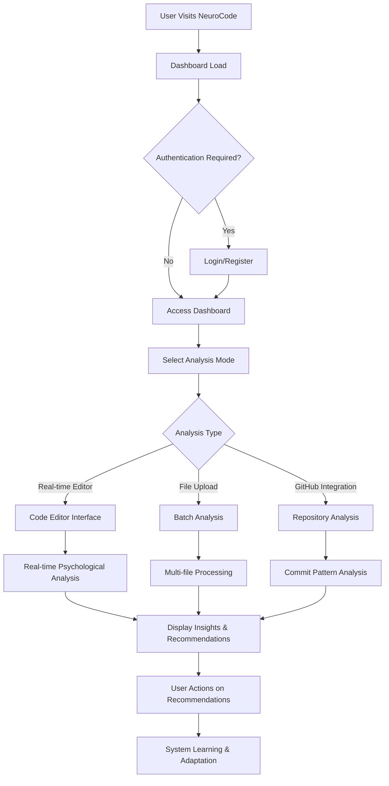
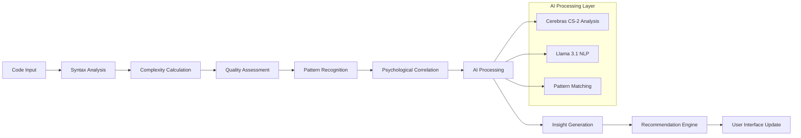
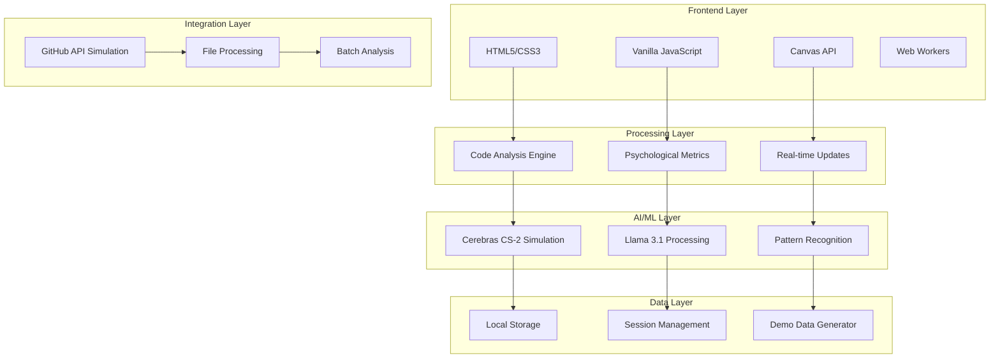

# Interactive System Design Documentation - Design Document

## Overview

This design document outlines the creation of a comprehensive, interactive system design document for the NeuroCode AI-Powered Code Psychology Platform. The document will be web-native, featuring interactive flows, detailed technical analysis, and research validation.

## Architecture

### Document Structure Architecture

```
Interactive System Design Document
├── Executive Overview
│   ├── System Innovation Summary
│   ├── Key Performance Indicators
│   └── Business Impact Analysis
├── System Architecture
│   ├── High-Level Architecture Diagram
│   ├── Component Interaction Maps
│   └── Technology Stack Overview
├── Interactive System Flows
│   ├── User Journey Flow
│   ├── Data Processing Pipeline
│   ├── AI/ML Inference Flow
│   ├── Real-Time Analysis Flow
│   └── Integration & Deployment Flow
├── Tools & Components Analysis
│   ├── Frontend Technologies
│   ├── AI/ML Infrastructure
│   ├── Data Processing Layer
│   └── Deployment & DevOps
├── System Operations
│   ├── Operational Workflows
│   ├── Monitoring & Alerting
│   ├── Scaling Strategies
│   └── Maintenance Procedures
├── Feasibility & Integration
│   ├── Technical Feasibility Assessment
│   ├── Integration Complexity Analysis
│   ├── Risk Assessment & Mitigation
│   └── Optimization Recommendations
└── References & Research Alignment
    ├── Academic Research Foundation
    ├── Industry Best Practices
    ├── Validation Studies
    └── Future Research Directions
```

### Interactive Features Design

#### 1. Mermaid.js Flow Diagrams
- **User Flow Diagrams:** Step-by-step user interactions
- **Data Flow Diagrams:** Information processing pipelines
- **System Architecture Diagrams:** Component relationships
- **Deployment Diagrams:** Infrastructure and scaling

#### 2. Interactive Elements
- **Expandable Sections:** Progressive disclosure of complex information
- **Hover Effects:** Additional context on diagram elements
- **Code Snippets:** Syntax-highlighted implementation examples
- **Live Links:** Direct connections to running system components

#### 3. Responsive Design
- **Mobile-First Approach:** Optimized for all screen sizes
- **Progressive Enhancement:** Advanced features for capable browsers
- **Accessibility Compliance:** WCAG 2.1 AA standards
- **Performance Optimization:** Fast loading and smooth interactions

## Components and Interfaces

### 1. Document Generation System

#### HTML Structure Generator
```html
<!DOCTYPE html>
<html lang="en">
<head>
    <meta charset="UTF-8">
    <meta name="viewport" content="width=device-width, initial-scale=1.0">
    <title>NeuroCode System Design</title>
    <link rel="stylesheet" href="system-design.css">
    <script src="https://cdn.jsdelivr.net/npm/mermaid/dist/mermaid.min.js"></script>
</head>
<body>
    <nav class="table-of-contents">
        <!-- Dynamic TOC generation -->
    </nav>
    <main class="document-content">
        <!-- Section-based content -->
    </main>
    <script src="interactive-features.js"></script>
</body>
</html>
```

#### CSS Framework
```css
/* Responsive grid system */
.document-grid {
    display: grid;
    grid-template-columns: 250px 1fr;
    gap: 2rem;
    max-width: 1400px;
    margin: 0 auto;
}

/* Interactive diagram containers */
.flow-diagram {
    background: white;
    border-radius: 8px;
    box-shadow: 0 4px 20px rgba(0,0,0,0.1);
    padding: 2rem;
    margin: 2rem 0;
}

/* Expandable sections */
.expandable-section {
    border: 1px solid #e0e0e0;
    border-radius: 8px;
    margin: 1rem 0;
}
```

#### JavaScript Interactivity
```javascript
class InteractiveSystemDesign {
    constructor() {
        this.initializeMermaid();
        this.setupExpandableSections();
        this.createTableOfContents();
        this.enableSmoothScrolling();
    }
    
    initializeMermaid() {
        mermaid.initialize({
            theme: 'default',
            flowchart: { useMaxWidth: true },
            sequence: { useMaxWidth: true }
        });
    }
    
    setupExpandableSections() {
        // Progressive disclosure implementation
    }
    
    createTableOfContents() {
        // Dynamic TOC generation
    }
}
```

### 2. Flow Diagram System

#### User Journey Flow


#### Data Processing Pipeline


### 3. Component Integration Map

#### Technology Stack Integration


## Data Models

### System Design Document Model
```javascript
class SystemDesignDocument {
    constructor() {
        this.sections = [
            {
                id: 'overview',
                title: 'Executive Overview',
                subsections: ['innovation', 'kpis', 'impact'],
                interactive: true
            },
            {
                id: 'architecture',
                title: 'System Architecture',
                subsections: ['components', 'integration', 'scalability'],
                diagrams: ['architecture', 'deployment']
            },
            {
                id: 'flows',
                title: 'Interactive System Flows',
                subsections: ['user-flow', 'data-flow', 'ai-flow'],
                interactive: true,
                mermaidDiagrams: true
            }
        ];
    }
}
```

### Flow Diagram Model
```javascript
class FlowDiagram {
    constructor(type, data) {
        this.type = type; // 'user', 'data', 'system', 'deployment'
        this.nodes = data.nodes;
        this.edges = data.edges;
        this.interactive = true;
        this.mermaidSyntax = this.generateMermaidSyntax();
    }
    
    generateMermaidSyntax() {
        // Convert data to Mermaid diagram syntax
    }
    
    render(containerId) {
        // Render interactive diagram
    }
}
```

## Error Handling

### Document Loading Errors
- **Graceful Degradation:** Static content when JavaScript fails
- **Progressive Enhancement:** Advanced features for capable browsers
- **Fallback Diagrams:** Static images when Mermaid.js fails to load
- **Content Validation:** Ensure all sections render properly

### Interactive Feature Errors
- **Feature Detection:** Check browser capabilities before enabling features
- **Error Boundaries:** Isolate interactive components to prevent cascade failures
- **User Feedback:** Clear error messages and alternative access methods
- **Performance Monitoring:** Track loading times and user interactions

## Testing Strategy

### Content Validation Testing
1. **Section Completeness:** Verify all required sections are present
2. **Link Validation:** Ensure all internal and external links work
3. **Diagram Rendering:** Test Mermaid.js diagrams across browsers
4. **Responsive Design:** Validate layout on multiple screen sizes

### Interactive Feature Testing
1. **User Flow Testing:** Verify all interactive elements function correctly
2. **Performance Testing:** Measure loading times and responsiveness
3. **Accessibility Testing:** Ensure compliance with WCAG guidelines
4. **Cross-Browser Testing:** Validate functionality across major browsers

### Integration Testing
1. **Content Integration:** Verify all sections work together cohesively
2. **Navigation Testing:** Ensure smooth transitions between sections
3. **Search Functionality:** Test document search and filtering features
4. **Mobile Experience:** Validate touch interactions and mobile navigation

## Implementation Phases

### Phase 1: Document Structure (Week 1)
- Create HTML template with responsive grid
- Implement basic CSS framework
- Set up Mermaid.js integration
- Create table of contents system

### Phase 2: Content Development (Week 2)
- Write comprehensive content for all sections
- Create interactive flow diagrams
- Develop component analysis sections
- Implement research references system

### Phase 3: Interactive Features (Week 3)
- Add expandable sections and progressive disclosure
- Implement diagram interactivity
- Create smooth scrolling and navigation
- Add search and filtering capabilities

### Phase 4: Polish & Optimization (Week 4)
- Performance optimization and caching
- Accessibility improvements
- Cross-browser compatibility fixes
- Final content review and validation

This design provides a comprehensive foundation for creating an interactive, web-native system design document that meets all specified requirements while maintaining high standards for usability, accessibility, and technical accuracy.